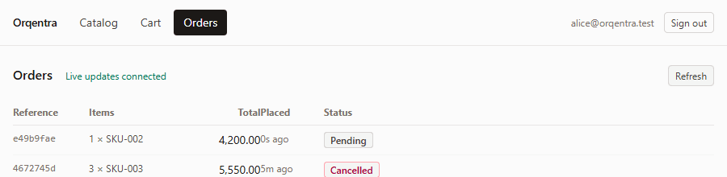
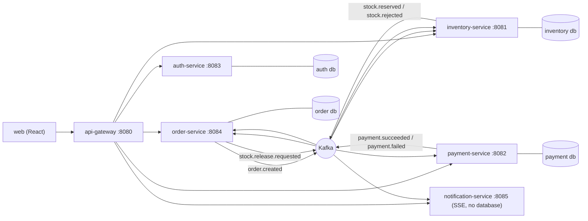
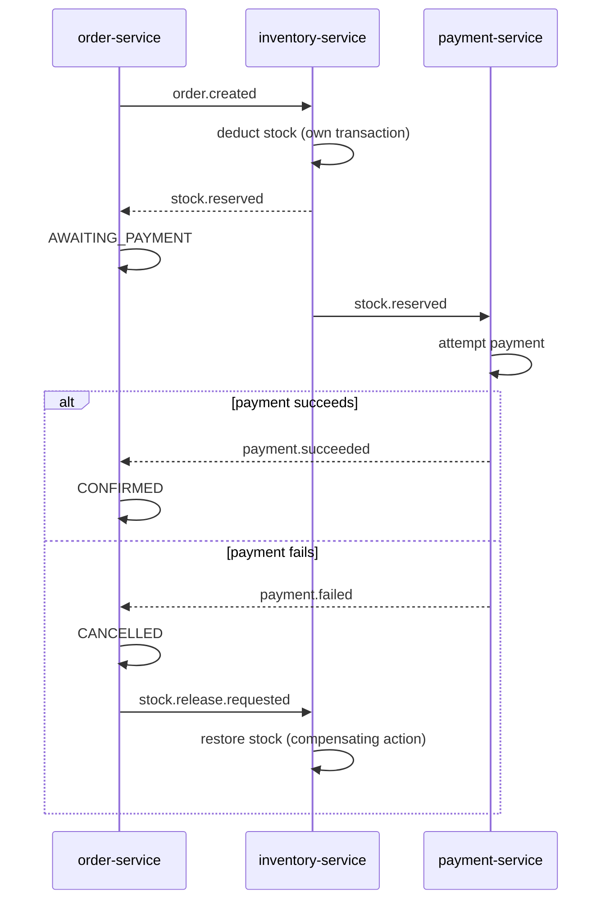
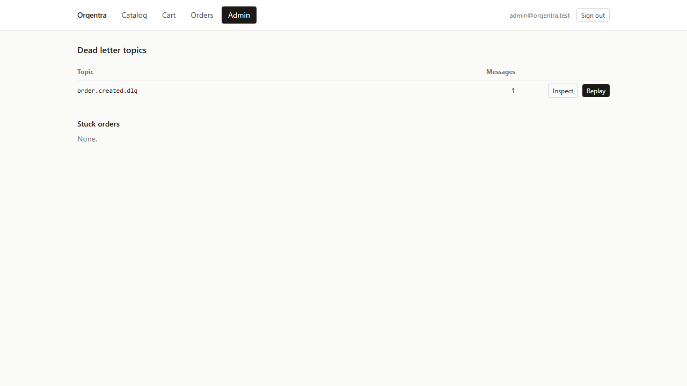
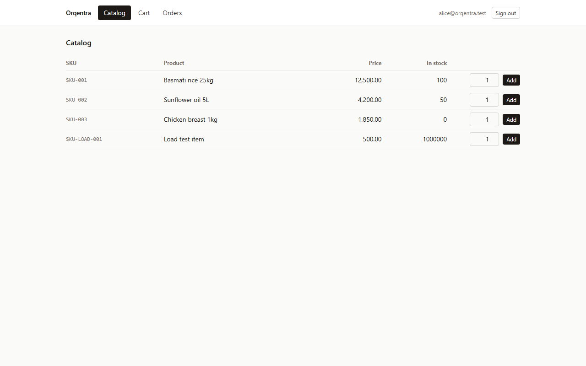
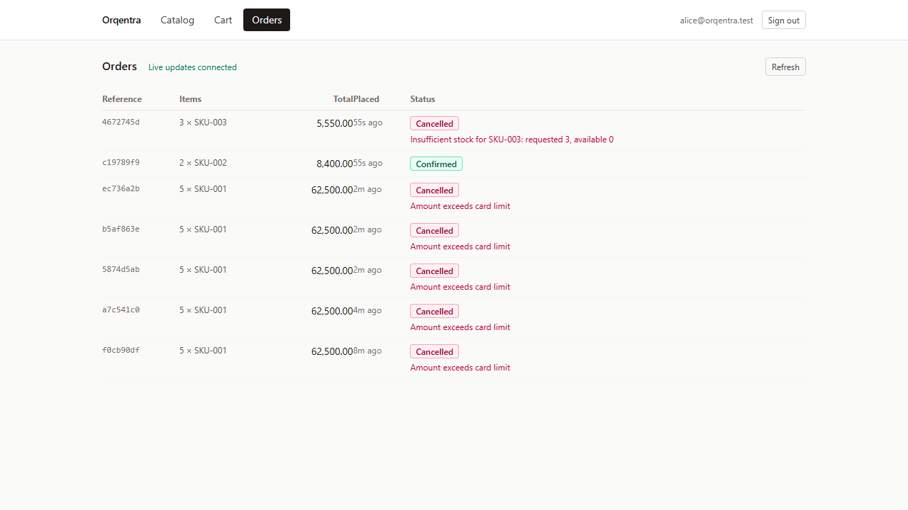
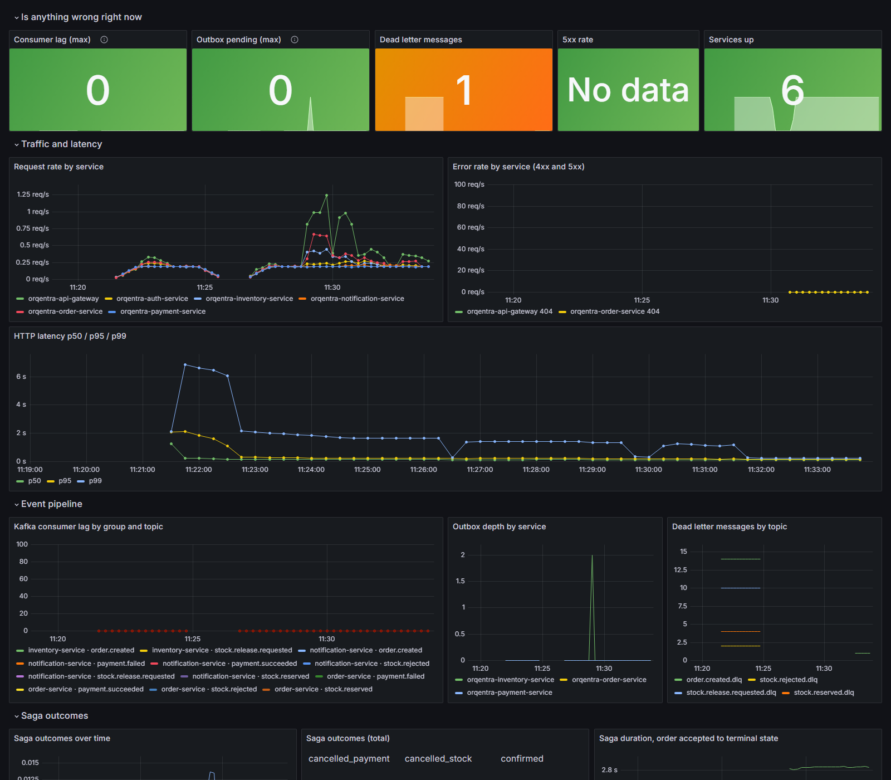
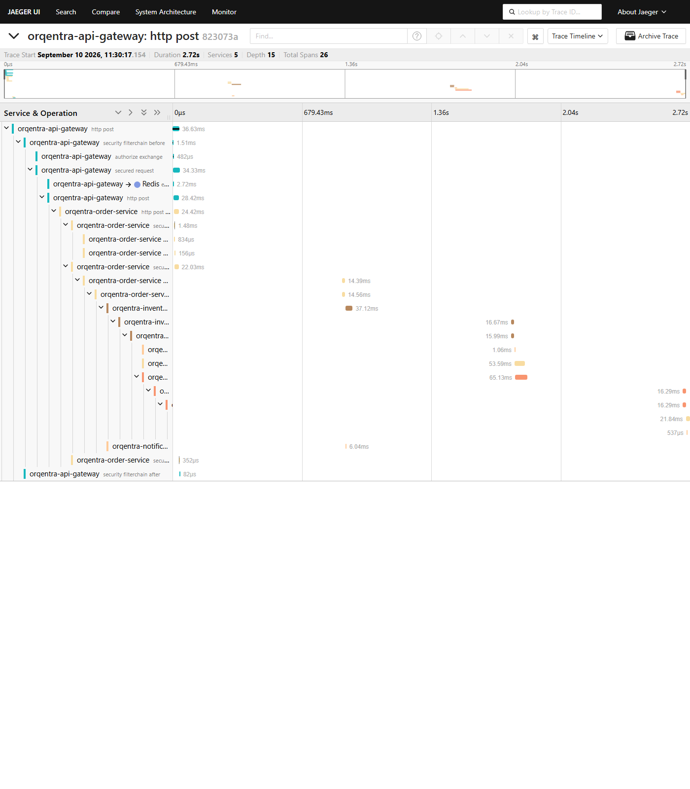

# Orqentra

A B2B ordering platform for restaurants buying from suppliers, built to show what it
takes to keep six independently-owned databases consistent without a distributed
transaction.

[](https://github.com/minidu10/Orqentra/actions/workflows/ci.yml)



## The problem

An order here touches three databases: the order service records the order, the
inventory service deducts stock, the payment service charges for it. Each service owns
its own database and nothing else is allowed to read it directly, so there is no single
transaction that can span all three. If the deduction commits and the payment then
fails, nothing in Postgres, in Kafka, or anywhere else automatically puts that stock
back. Someone has to decide to undo it, and until they do, the system is quietly wrong:
stock is reserved for an order that no longer exists.

That is the saga pattern's whole reason to exist. Instead of one transaction, each step
commits on its own and publishes an event saying what happened. The next service reacts
to that event and commits its own step. If a later step fails, the earlier ones are not
rolled back — they are undone by another forward-moving step, a compensating action,
because there is nothing left to roll back to. The rest of this document is largely
about the consequences of that one decision: what has to be true for it to be safe, and
what stays true even when it works exactly as designed.

## Architecture



| Service | Port | Owns |
|---|---|---|
| `api-gateway` | 8080 | The only port a client should use |
| `inventory-service` | 8081 | Stock levels |
| `payment-service` | 8082 | Payment attempts |
| `auth-service` | 8083 | Users, restaurants, JWT issuing |
| `order-service` | 8084 | Orders, catalog, admin API |
| `notification-service` | 8085 | Live SSE stream, no database |

No service reads another service's tables. `order-service` publishes `order.created` and
finds out what happened next only by consuming events back — it never calls the
inventory database, even though nothing stops the two Postgres instances talking to each
other on the network.

## The saga



A rollback is not available here: by the time payment fails, the deduction is already
committed in a different database, in a different transaction, that closed before
payment was ever attempted. The only way to undo it is another write that says the
opposite thing — release, not un-deduct — and that write has to survive the same
failures the original one did: a crash, a redelivery, a slow consumer. It is a real
operation with its own transaction and its own place in the log, not a rollback in
disguise.

Here is one actual run, log lines pulled unedited from the four services for one order
that failed the payment decline check:

```
11:26:45.817  inventory-service   Order created a7c541c0-…, reserving 1 line(s)
11:26:45.836  inventory-service   Reserved stock for order a7c541c0-…
11:26:46.637  order-service       Stock reserved for order a7c541c0-…, awaiting payment of 62500.00
11:26:46.833  payment-service     Attempting payment of 62500.00 for order a7c541c0-…
11:26:46.846  payment-service     Payment failed for order a7c541c0-…: Amount exceeds card limit
11:26:47.600  order-service       Payment failed for order a7c541c0-…: Amount exceeds card limit, requesting stock release
11:26:47.764  inventory-service   Releasing stock for order a7c541c0-…: Amount exceeds card limit
```

Between `11:26:45.836` and `11:26:47.764` — **1.93 seconds** — the inventory database
genuinely believed stock was committed to an order that was, by that point, already
guaranteed to fail. Nothing in the system could have told you that by looking at
inventory alone. That gap is not a bug; it is the cost of giving up the one transaction
that would have closed it, and it is why every service that touches shared state in this
codebase has to assume the event it just received might describe a world that has
already moved on.

## Reliability patterns

**Idempotent consumers.** Kafka delivery here is at-least-once: a crash after a message
is processed but before the offset commits means it arrives again. Without a dedupe
check, that redelivery would deduct stock twice, charge a card twice, or release stock
twice. Every listener claims the event id in the same transaction as the business change
(`ProcessedEvents.claim`, e.g.
[inventory-service/.../messaging/ProcessedEvents.java](inventory-service/src/main/java/com/orqentra/inventory/messaging/ProcessedEvents.java)),
so the claim and the effect commit together or not at all.

**Transactional outbox.** Writing to Postgres and publishing to Kafka is two systems,
and a crash between them either loses the event or duplicates it. Instead, the event is
written as a row in the same transaction as the state change it describes, and a
separate poller (`OutboxPublisher`, `@Scheduled(fixedDelay = 1000)`) publishes
unpublished rows afterwards, marking each published only once Kafka acknowledges it.
That makes the write atomic with the state change, but it makes publishing
**at-least-once**, not exactly-once: a crash after the Kafka ack and before the row is
marked published republishes it next cycle.

**The two only work as a pair.** The outbox is what guarantees an event is never lost —
and that guarantee is exactly what makes duplicates possible. Idempotent consumers are
what make those duplicates harmless. Either one alone leaves a hole: idempotency without
an outbox still loses events on a crash between the two writes; an outbox without
idempotency turns every retry into a double deduction. Together, "at least once" plus
"applied at most once" gives you exactly the outcome you wanted — applied exactly once —
without ever needing a single distributed transaction to say so.

**Dead letter queues.** A message that can never succeed — malformed JSON, a payload the
listener rejects outright — must not block every message behind it on that partition
forever. `MessagingConfig.kafkaErrorHandler` (e.g.
[inventory-service/.../messaging/MessagingConfig.java](inventory-service/src/main/java/com/orqentra/inventory/messaging/MessagingConfig.java))
retries a genuinely transient failure three times with exponential backoff, and routes
anything classified as non-retryable straight to `<topic>.dlq` instead. The admin screen
below shows one such message, generated by publishing a deliberately malformed record
directly to `order.created` for this README:



## Live updates

The React UI reads Server-Sent Events from `notification-service`, but treats every
event as an optimisation, never as the source of truth. HTTP is authoritative: the order
list comes from a `GET`, and the stream only patches rows that fetch already returned.
The reason is `notification-service` keeps no database and no replay buffer — it is
purely a fan-out of whatever Kafka messages arrive while a client happens to be
connected. Disconnect for any reason, even a laptop going to sleep, and every event that
occurred during that gap is gone for good, with no way to ask for it again. A client
that trusted the stream as its state would end up permanently wrong after exactly one
dropped connection, and would look perfectly fine while being wrong. So every reconnect
triggers a full re-fetch, and an event for an order the client has never seen also
triggers one, rather than the client trying to reconstruct a row from a fragment
([web/src/orders/useOrders.ts](web/src/orders/useOrders.ts)).

## Running locally

Prerequisites: Docker, JDK 21, Node 20+.

```powershell
.\dev.ps1          # infrastructure, all six services, and the UI
.\dev.ps1 -Stop    # stop the services and the dev server
```

Or by hand: `docker compose up -d`, then in its own terminal per service, `.\mvnw.cmd
spring-boot:run` in `auth-service`, `inventory-service`, `payment-service`,
`order-service`, `notification-service`, `api-gateway` — then `npm install && npm run
dev` in `web`.

UI: `http://localhost:5173` — API: `http://localhost:8080` (everything goes through the
gateway) — Redpanda console: `http://localhost:8090`

| Email | Password | Role |
|---|---|---|
| `alice@orqentra.test` | `alice-pass` | `RESTAURANT` |
| `bob@orqentra.test` | `bob-pass` | `RESTAURANT` |
| `admin@orqentra.test` | `admin-pass` | **`ADMIN`** — sees the Admin screen |

Passwords are BCrypt hashes in a Flyway seed migration; these are the dev-only
plaintexts.

| Catalog | Orders |
|---|---|
|  |  |

## Testing

```bash
cd order-service && ./mvnw test   # same for inventory-service, payment-service, auth-service
```

Integration tests run against real Postgres and real Redpanda via
[Testcontainers](https://testcontainers.com) — nothing is mocked at that layer.
`e2e-tests/` runs three services as real processes and drives the saga end to end,
asserting the final stock count exactly rather than only that an event was published.
The frontend has its own Vitest suite covering the SSE frame parser and the orders
hook's reconnect behaviour. All of it runs on every push — see the CI badge above.

## Load test results

Measured with [k6](https://k6.io) against the whole stack on **one development laptop
(13th Gen Intel Core i5-1335U, 16 GB RAM, Windows 11) — this is not a production
benchmark.** Full methodology in [load-test/README.md](load-test/README.md).

- 30 concurrent restaurants: **3,248 HTTP requests, 23.7 req/s, 0% failed.** p95 latency
  69ms (catalog), 64ms (stock), 80ms (place order).
- **797 orders placed, 100% eventually confirmed.** Average time from accepted to
  `CONFIRMED`: **~3.2s** — dominated by the outbox poller's 1-second cycle, paid three
  times across the three sequential hops a confirmed order makes, not by HTTP or
  database work.
- Peak Kafka consumer lag: 6 messages. Peak outbox depth: 17 rows. Both drained to zero
  within seconds of the load easing.

## Observability

| Tool | URL |
|---|---|
| Jaeger | `http://localhost:16686` |
| Prometheus | `http://localhost:9090` |
| Grafana | `http://localhost:3001` (anonymous viewer, or admin/admin) |

The dashboard's top row answers "is anything wrong right now" without scrolling:
consumer lag, outbox depth, dead letter count, error rate, services up. This is a real
run, mid-load, with one deliberately dead-lettered message still showing:



To find one order's trace: place an order, note the reference, open Jaeger, choose
service `orqentra-api-gateway`, operation `http post`, and Find Traces. The saga is a
single trace across five services. This is a real one, 26 spans, 2.72 seconds end to
end, for an order that reached `CONFIRMED`:



## Known simplifications

Left this way on purpose, not missed:

- **Symmetric JWT secret**, shared by every service, instead of asymmetric signing with
  a JWKS endpoint each service fetches independently.
- **JWT in `localStorage`**, readable by any script that runs on the page. The
  production answer is an httpOnly, `SameSite` cookie, which JavaScript cannot read at
  all ([web/src/api/auth.ts](web/src/api/auth.ts)).
- **`notification-service` holds routing state in memory** — which SSE connection wants
  which restaurant's events — and loses it on restart. It cannot scale past one instance
  without a shared backplane (Redis pub/sub, or similar) to fan events out across
  replicas.
- **Event schemas are duplicated per service** (`EventTypes.java`, one copy per
  consumer) rather than pulled from a shared library or a schema registry. Each service
  can drift from what it actually receives with nothing to catch it at compile time.
- **The catalog fetches stock per row** — one HTTP request per product — rather than in
  a batch, an N+1 left in deliberately (see the comment in
  [web/src/pages/CatalogPage.tsx](web/src/pages/CatalogPage.tsx)).

## What a production version would need

This list is about the business, not the code. B2B food distribution does not behave
like consumer e-commerce, and this model borrows consumer assumptions in a few places
that would need to change before this could run a real supplier:

- **Credit, not cards.** Restaurants buy on monthly invoice terms against a credit
  limit. The check that matters is outstanding balance versus limit, not a simulated
  card decline.
- **Negotiated pricing.** There is one price per product here. In practice each customer
  has their own negotiated price list.
- **Unit of measure and pack size.** A quantity of two is ambiguous — two bottles, or
  two cases of twenty-four — and the model here has no way to say which.
- **Delivery dates with a cut-off**, not instant fulfilment. Orders accumulate against a
  delivery window rather than being processed the moment they arrive.
- **Partial fulfilment is normal**, not a failure. Receiving eight of ten ordered is an
  everyday outcome in this business. The saga here cancels the whole order on any
  shortfall, which is functionally wrong for this domain — a partial reservation with a
  partial confirmation is the correct shape, and this system cannot express it.
- **Suppliers should own their own catalog and prices.** Here, one admin owns every
  product for every supplier, which does not reflect how multiple independent suppliers
  would actually operate on the same platform.

